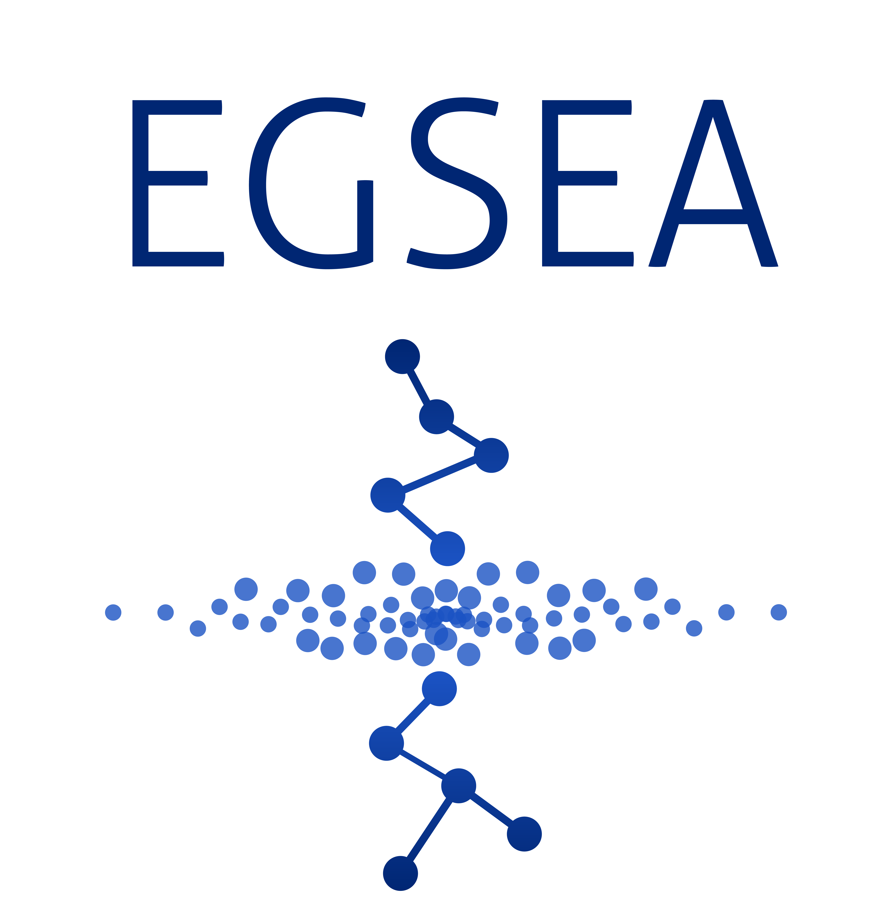

#Ensemble of Gene Set Enrichment Analyses

<div align="center">

<br />
<sub>Credit: Roberto Bonelli </sub>
</div>

This package is part of the **Bioconductor** project and implements the Ensemble of Gene Set Enrichment Analyses (EGSEA) method for gene set testing.

**Author:** Monther Alhamdoosh, Luyi Tian, Milica Ng and Matthew Ritchie

**Maintainer:** Monther Alhamdoosh <m.hamdoosh at gmail.com>

Citation (from within R, enter ```citation("EGSEA")```):

Alhamdoosh M, Ng M, Wilson N, Sheridan J, Huynh H, Wilson M and Ritchie M (2017). “Combining multiple tools outperforms individual methods in gene set enrichment analyses.” *Bioinformatics*, 33(3). doi: 10.1093/bioinformatics/btw623.

#Installation

To install the *stable release* of this package, start R and enter:
```{r}
## try http:// if https:// URLs are not supported
source("https://bioconductor.org/biocLite.R")
biocLite("EGSEA")
```

To install the *development version* of this package, start R and enter:
```{r}
install.packages("devtools") # if you have not installed "devtools" package
devtools::install_github("malhamdoosh/EGSEA")
```

#Documentation

To view documentation for the version of this package installed in your system, start R and enter:
```{r}
browseVignettes("EGSEA")
```


